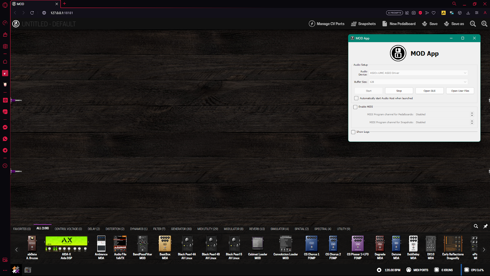

# MOD App

**MOD Audio is on the desktop!**

This is the source code repository for MOD App, a little tool by [MOD Audio](https://mod.audio/) that combines all the goodies from MOD for the desktop platform packaged in a convenient installer.

## Current status

At this point this tool should be considered VERY EXPERIMENTAL.
Specially due to MOD related software and plugins never been tested on Windows systems before.
Feedback and testing is very much appreciated, make sure to report issues you find during your own testing.

Current known issues:

- Pedalboard save fails to create screenshot/thumbnail
- Handling of Windows filepaths is not always correct (differences between POSIX vs Windows path separators)
- jackd.exe (through mod-host) asks for public network permissions which are not needed
- JACK is used "as-is", which assumes it is not running yet. TBD if we use a custom server name or something else
- Host crash stops the UI process, instead of being automatically restart like in MOD units

## Download

MOD App only has builds for Windows 64bit for now, find them in the [releases section](https://github.com/moddevices/mod-app/releases).

## Development

For now we are still setting things up, specially in regards of having everything automated and building through GitHub Actions.
Then macOS related handling is still needed, but for now focus is on Windows just to get 1 platform working well enough to be usable.

If you want to contribute, here are a few items where help would be appreciated:

- Debugging and fixing Windows specific issues within mod-ui (*)
- Documentation regarding "universal" ASIO drivers, like ASIO4ALL and FlexASIO, and how to set them nicely for MOD App

(*) Note: on Windows the default installation has html/css/js files in `C:\Program Files\MOD App\html` and python files in `C:\Program Files\MOD App\mod`, which can be directly modified, making it very easy and convenient to try out any changes.

Also help in these areas, but they are much more involved:
- Create a JACK-API-compatible node-based audio graph, to be used for eventually running "mod-app as a plugin" (there are a few opensource libs for this already, like the one included in miniaudio)
- Custom [jack-router](https://github.com/jackaudio/jack-router) build targetting MOD App (TBD how to best package jack2 within mod-app)
- Fix jack2 winmme MIDI handling, as per [jack2#931](https://github.com/jackaudio/jack2/issues/931)

## License

MOD App is licensed under AGPLv3+, see [LICENSE](LICENSE) for more details.  
