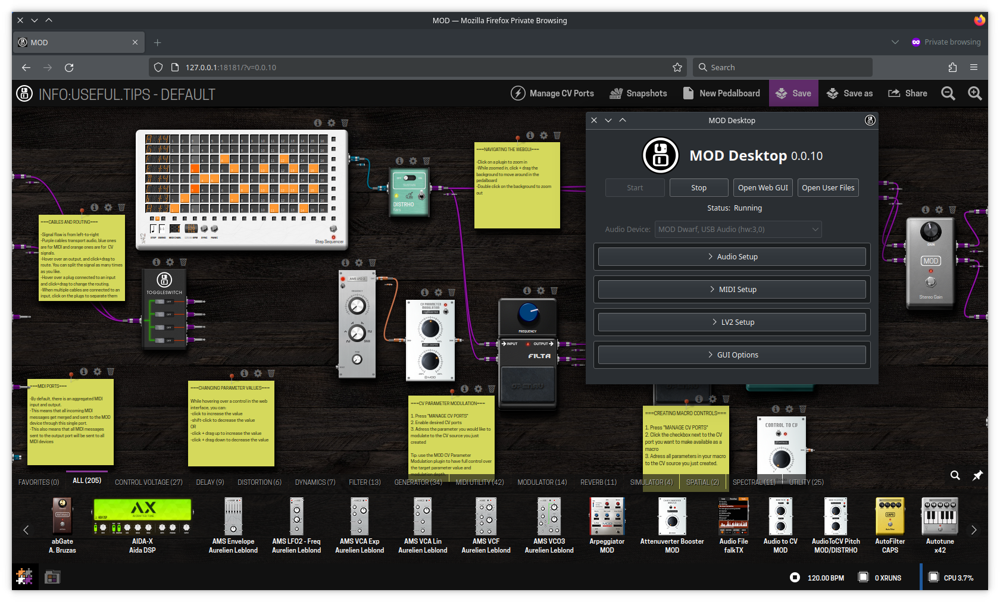
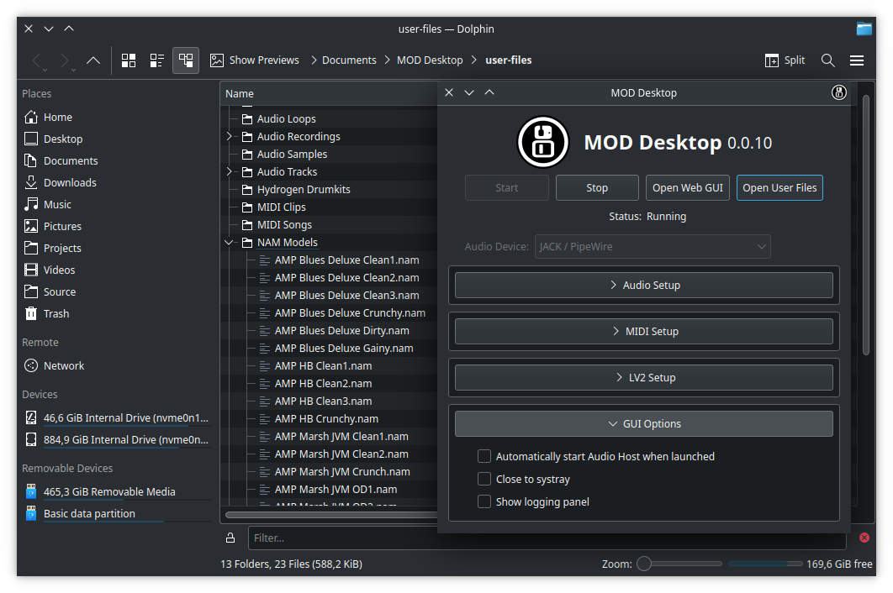
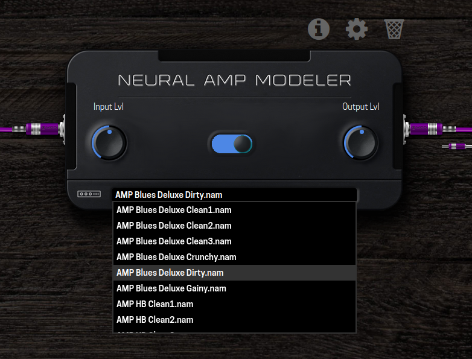

# MOD Desktop

**MOD Audio is on the desktop!**

This is the source code repository for MOD Desktop, a little tool by [MOD Audio](https://mod.audio/) that combines all the goodies from MOD for the desktop platform packaged in a convenient installer.

What this actually means is that you get a virtual pedalboard setup in a node/patchbay-like fashion, where you load "pedals" which are basically just LV2 audio plugins.  
Everything is drag & drop based, so you drop plugins from the bottom plugin bar into the main pedalboard view (called "constructor") and then drag & drop output-facing cables into either other plugins or the right side of the constructor.  
Unlike typical physical pedalboards where the signal flows from right to left, on MOD Desktop the signal flows from left to right as that is more common on desktop UIs.

See [https://wiki.mod.audio/wiki/MOD_Web_GUI_User_Guide](https://wiki.mod.audio/wiki/MOD_Web_GUI_User_Guide) for a more in-depth explanation of UI details, though please note a few things will not be the same due to platform differences.

## Download

MOD Desktop has builds for:

- Linux x86_64
- macOS universal (Intel + Apple Sillicon)
- Windows 64bit

You can find them in the [releases section](https://github.com/moddevices/mod-desktop/releases).

These downloads contain both MOD Desktop and a couple of plugins ready for usage.

## Installing

Installation depends on your operating system.

For **Linux** systems we currently provide a binary tarball, you just extract and run the startup script inside.
Eventually we want to have MOD Desktop under Flathub, please get in touch if you want to help make that happen.

For **macOS** we provide a (for the moment unsigned) pkg installer, compatible with both Intel and Apple Sillicon systems.
You need to right-click the installer and click "open" for it to be allowed to install.
After installation you can find "MOD Desktop" under your "Applications" folder.  
NOTE: For the final release we will sign the macOS installer so you can double-click on it as usual.

And finally for **Windows** there is a simple installer executable, that shows an installer wizard as typical for most Windows applications.

## Usage

By default MOD Desktop will show you as few controls as possible, to not get in the way.
You just need to pick a soundcard you wish to use and press "Start".
This will start up the audio engine and (local) web service that manages the session and plugins.

Once the engine is running, click the "Open Web GUI" button to open the MOD UI view in your default web browser.  
NOTE: even though this uses a web browser, the page is being served locally; the use of web technologies is an intentional design choice for making the UI cross-platform compatible.

If anything fails you can enable debug logs in the "GUI Options" section, that might provide some information.

MOD Desktop will close to the "system tray" by default, but this can also be changed in the "GUI Options".

### Handling files

There are a few plugins on the MOD platform, like AIDA-X and NAM, that load external files.
On their GUIs they will list the files as available under $Documents/MOD Desktop/user-files directory (the actual file path depends on the operating system).

You are meant to copy the files you wish to load into the relevant directory for them.
For convenience, MOD Desktop includes a "Open User Files" button that will automatically open your file explorer in the directory dedicated to such files.
So when wishing to load NAM models for the "Neural Amp Modeller" plugin for example, simply copy your model files into the "NAM Models" subdirectory.

## Current status

At this point this tool should be considered in beta state.
Most things already work but we are still tweaking and fixing a lot, specially due to MOD related software and plugins never been tested on Windows systems before.
Feedback and testing is very much appreciated, make sure to report issues you find during your own testing.
When reporting issues make sure to create 1 ticket per issue, and give some information about your system (what OS and version, what soundcard you use)

Current known issues:

- Handling of Windows filepaths is not always correct (differences between POSIX vs Windows path separators)
- When mod-host crashes it will stop the UI process, instead of being automatically restarted like in MOD units

## Development

If you want to contribute, here are a few items where help would be appreciated:

- Debugging and fixing Windows specific issues within mod-ui (*)
- Documentation regarding "universal" ASIO drivers, like ASIO4ALL and FlexASIO, and how to set them nicely for MOD Desktop

(*) Note: on Windows the default installation has html/css/js files in `C:\Program Files\MOD Desktop\html` and python files in `C:\Program Files\MOD Desktop\mod`, which can be directly modified, making it very easy and convenient to try out any changes.

Also help in these areas, but they are much more involved:
- Create a JACK-API-compatible node-based audio graph, to be used for eventually running "mod-desktop as a plugin" (there are a few opensource libs for this already, like the one included in miniaudio)
- Create a virtual sound device for macOS that can send audio into a JACK client, similar to JACK-Router and WineASIO projects

## License

MOD Desktop is licensed under AGPLv3+, see [LICENSE](LICENSE) for more details.
